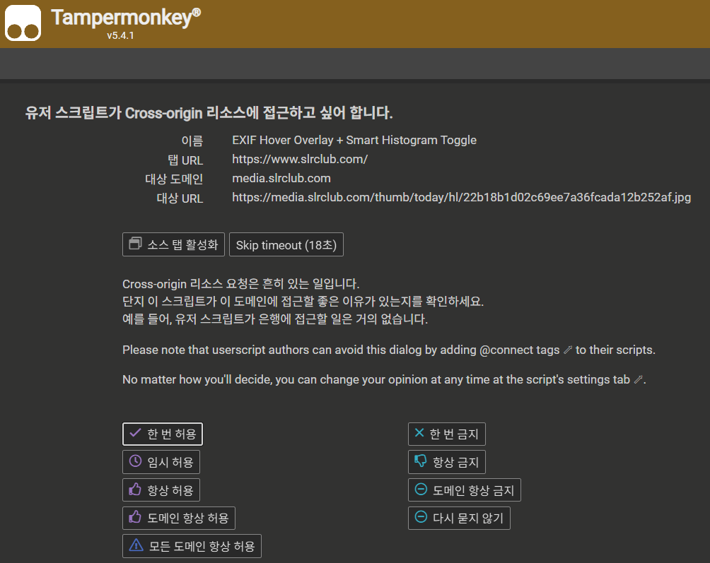

# EXIF Histogram Viewer

웹페이지에서 사진 위에 마우스를 올리면  
**EXIF 정보, 히스토그램, GPS 촬영 위치**를 바로 확인할 수 있는 Tampermonkey 스크립트입니다.

사진을 다운로드하지 않고 촬영 정보를 빠르게 확인할 수 있습니다.

---

# 기능

- EXIF 촬영 정보 표시  
- 히스토그램 표시  
- GPS 촬영 위치 표시  
- 이미지 위에 마우스를 올리면 자동 표시

---

# 설치 방법 (3단계)

## 1️⃣ Tampermonkey 설치

크롬에서 Tampermonkey 확장 프로그램을 설치합니다.

https://tampermonkey.net/

Chrome Web Store에서 **Add to Chrome** 클릭

---

## 2️⃣ 스크립트 설치

아래 링크 클릭 후 **Install 버튼** 누르기

https://raw.githubusercontent.com/tlwh1/exif-histogram-viewer/main/exif-histogram-viewer.user.js

---

## 3️⃣ 사용

사진이 있는 웹페이지에서

**이미지 위에 마우스를 올리면 정보가 표시됩니다.**

---

# 권한 요청 창이 뜨는 경우

처음 사용할 때 아래와 같은 창이 나타날 수 있습니다.

이미지 EXIF 정보를 읽기 위해  
**이미지 서버에 접근할 때 나타나는 정상적인 안내입니다.**

추천 선택

**도메인 항상 허용**

또는

**한 번 허용**

---

# 필요 환경

- Chrome
- Tampermonkey

---

# Author

tlwh1